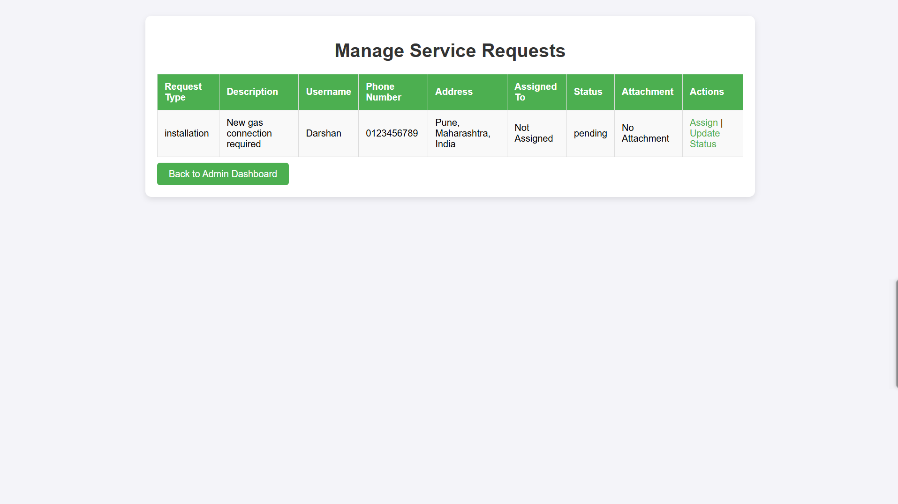
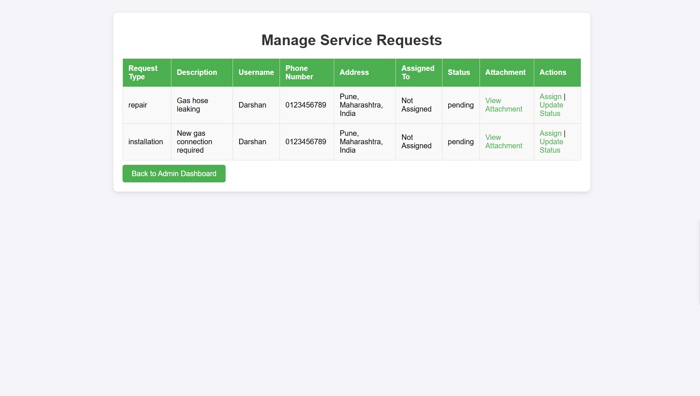

# Bynry Case Study

This is a my Django-based Service Request Management System for Gas Utility Company, that allows users to submit service requests, track their status, access customer support and enables administrators to manage these requests efficiently.

## Table of Contents
1. [Prerequisites](#prerequisites)
2. [Setup Instructions](#setup-instructions)
3. [Installation of Dependencies](#installation-of-dependencies)
4. [Running the Project](#running-the-project)
5. [Screenshots and Features](#screenshots-and-features)

## Prerequisites

Make sure you have the following installed on your machine:

- Python (3.10 or above)

- Django (5.1.2)
  
## Setup Instructions

1. **Clone the Repository**
   ```bash
   git clone https://github.com/DarshanBanait/Bynry.git
   cd Bynry
2. **Create a Virtual Environment - Recommended
   ```bash
   python -m venv venv
   source venv/bin/activate  # For macOS/Linux
   venv\Scripts\activate  # For Windows

##Installation of Dependencies

1. Install dependencies using pip
   ```bash
       pip install -r requirements.txt
   
##Running the Project

1. Apply Migrations
   ```bash
     python manage.py makemigrations
     python manage.py migrate

2. Create a Superuser (Admin)
   ```bash
     python manage.py createsuperuser

3. Run the development server
   ```bash
     python manage.py runserver

## Sign Up


## Login - Customer Account


## User Dashboard


## User Dashboard - Submitting New Request 


## Submitting a request


## User Dashboard - Tracking Request


## User Dashboard - Customer Support


## Login - Admin


## Admin Dashboard


## Admin Dashboard - Managing Requests



## Admin Dashboard - Assigning Requests to Employees


## Admin Dashboard - Updating Request Status




